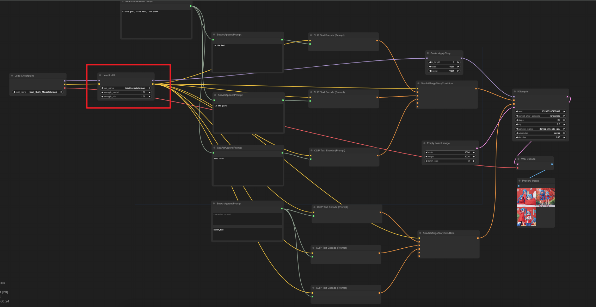
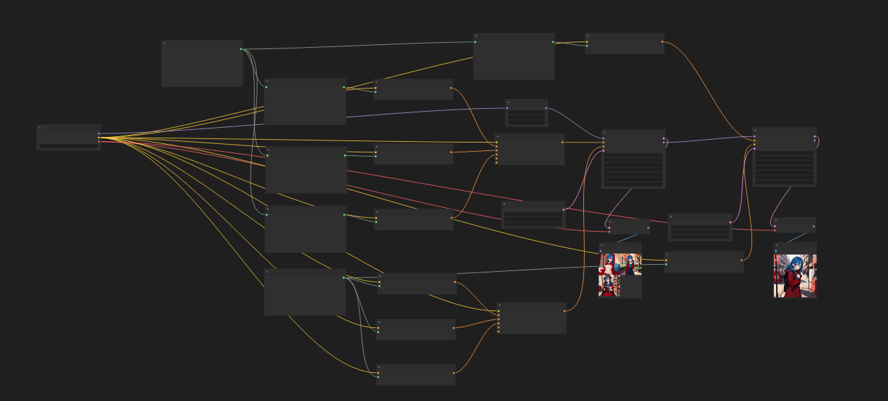

# comfyui-storydiffusion
本项目是storydiffusion的comfyui实现，项目中没有使用diffusers的结构，所以会全面兼容comfyui的unet的所有模型结构，在原本sdxl的基础上同样支持使用sd1.5以及sd2.x，当然也包括lora clip_skip这些组件，项目中的SeaArtApplyStory会patch掉原本comfyui的部分模块，根据论文的实现，受影响的只有unet上采样阶段的attention模块，由于处理过程中id_length的信息会被cache在attention模块中，目前我们会占时保存在cpu而非cuda中，所以建议您的id_length不易过大，同样我们提供了SeaArtStoryKSampler和SeaArtStoryKSamplerAdvanced，本质上只是对comfyui的采样器的简单封装，返回的model会保留必要的cache信息，帮助您在story的后续生成模式（write=false）的阶段继续使用，在write=false之后的流程,cache不会再持续增大，理论上您可以无限生成，接下来将介绍组件使用需注意的几点
SeaArtApplyStory为write=true的阶段，width height是您生成图片的尺寸，id_length表示为attention层需要关注的图片总数，所以需要condition的数量，latent的数量以及id_length保持统一
SeaArtStoryKSampler SeaArtStoryKSamplerAdvanced为对comfyui原本comfyui的简单封装，对返回cache额外信息后的model结构
SeaArtStoryInfKSampler SeaArtStoryKSamplerInfAdvanced之后，story会进入write=false的阶段，cache将不再增大,您可以在后面接入任意的sampler来保持形象
SeaArtMergeStoryCondition为额外提供的整理condition的组件，由于clip的max为77的特性，我们会自动识别过长的condition来把所有的condition补齐到attention可以运算的情况下，当然如果长度一致，则无需额外处理
SeaArtCharactorPrompt SeaArtAppendPrompt只是对string的简单拼接，您当然可以使用其他方式获得string

如果要搭配ella使用，您可能需要适当的修改组件，抑或是点赞给我们留下issue，我们会在后续空余的时间来考虑处理所有的issue，兼容comfyui中各种生态，喜欢本项目请给我们点赞，您的鼓励是我们更新的动力
(另外我们认为在dit中可能该方法同样适用，对于即将发行的sd3在确定效果后我们会考虑支持)
原则上本项目可以支持comfyui生态中的绝大部分组件，但是adapter等并没有做测试
本项目不包含style prompt等string的处理，也不包含在图片上写上文字的流程
## Workflow
我们特意准备了使用例子，包含使用lora的例子，为了简化演示，我们例子简单，您无需安装其他插件

最后特别感谢[StoryDiffusion](https://github.com/HVision-NKU/StoryDiffusion)